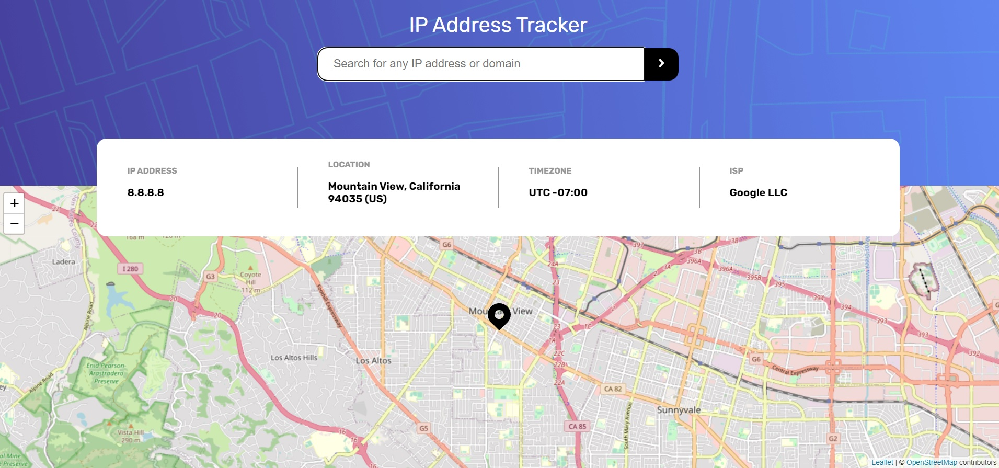

# ip-tracker

## Project informations
Web app that helps you to reach any **public** IP address locations in the world (using geo.ipify API).
Hosted on Netlify.

## Stack
- VueJS
- Vuex
- LeafletJS
- Sass

## Usage
To make requests successful, you'll probably have to **disable** your ad blocker on this site.

## Preview

